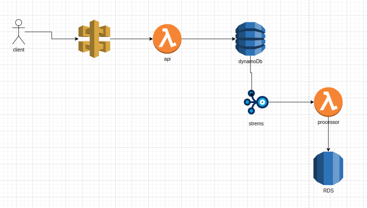

# Transaction API

Sistema de gerenciamento de transações financeiras utilizando AWS Lambda, DynamoDB, RDS (PostgreSQL/MySQL) e DynamoDB Streams para streaming de dados para o RDS.

---

## Funcionalidades
- Registrar transações no DynamoDB
- Listar transações
- Consultar saldo de um usuário por mês (`YYYY-MM`)
- Streaming de transações do DynamoDB para o RDS para análise avançada
- Infraestrutura como Código (IaC) com Terraform
- Testes automatizados com Jest

---

## Tecnologias Utilizadas
- **Node.js** com TypeScript
- **AWS Lambda** (Microsserviço Serverless)
- **AWS API Gateway** (Interface HTTP)
- **Amazon DynamoDB** (Banco de dados NoSQL)
- **Amazon RDS** (Banco de dados relacional para Analytics)
- **DynamoDB Streams** (Captura de eventos de transação)
- **Terraform** (Provisionamento de infraestrutura AWS)
- **Jest & Supertest** (Testes automatizados)

---

## Estrutura do Projeto
